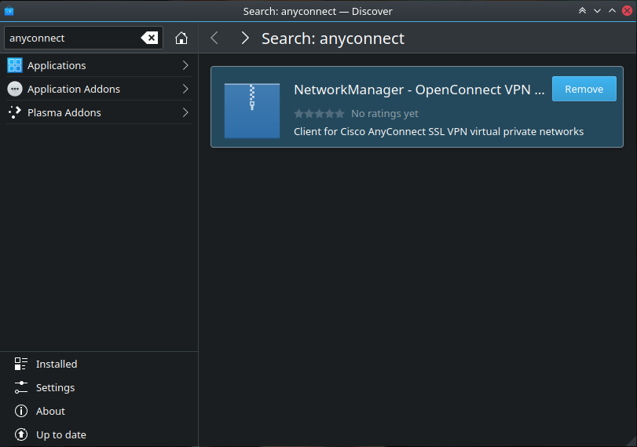
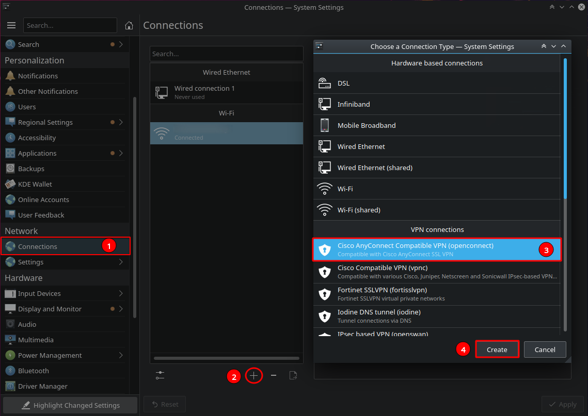
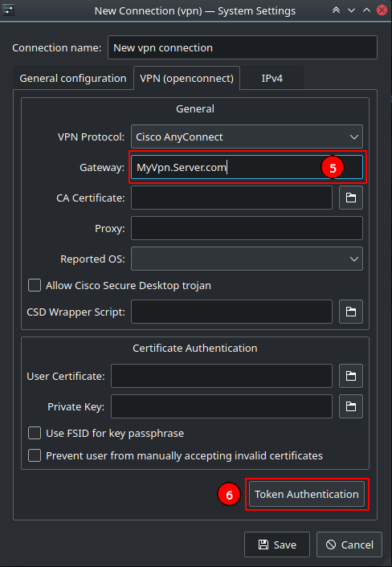
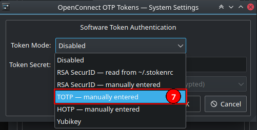
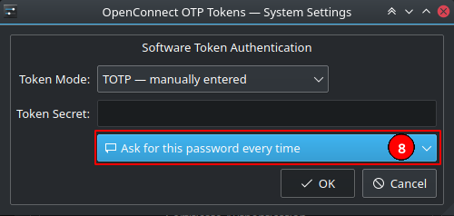
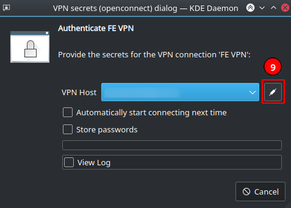
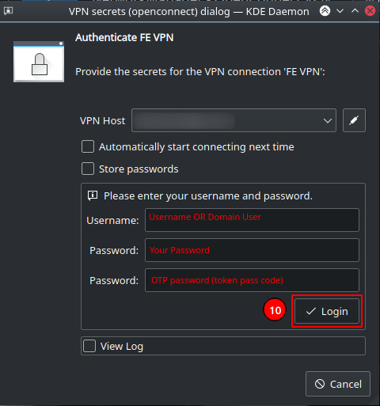

# How to Connect to Cisco AnyConnect using KDE NetworkManager \(GUI\)

## Step 1 \| Installing Dependencies

### Step 1.1 \| Installing NetworkManager OpenConnect

From **Discover**, Search for _anyconnect_ package and select "NetworkManager - OpenConnect"



Or from commandline 

```text
apt install network-manager-openconnect openconnect
```

## Step 2 \| Configuring KDE Network Manager

### Step 2.1 \| Create a New VPN Connection

1. **System Settings** &gt;&gt; **Connections** &gt;&gt; Press the **+** sign to create a new connect

1. **System Settings** &gt;&gt; **Connections**
2. Press the **+** sign to create a new connection
3. Select **Cisco AnyConnect Compatible VPN \(openconnect\)** option
4. Press **Create** button 



### Step 2.2 \| Add Connection Settings

5. Add the VPN server's \(VPN Gateway\) IP address or hostname

6. If your organization enforces MFA/2FA, press **Token Authentication** button



7. Select your MFA mechanizm \(you should know yours\)



8. Select how you would like to store the OTP. Most of the time you have a new token every time so you should not save the token and select "**Ask for this password every time**" then press **OK**.



### Step 2.3 \| Connect to the VPN

Once all is saved, now you have a VPN connection to use.

9. Select your VPN connection and the following window will show up. Press on the **connect icon** button.




At the first look, the popup window looks confusing as I was expecting to be prompted to enter my username, password, and passcode without the need to press the connect icon.

It would be much better if there was an obvious button called "Connect" on it right beside the Cancel button.


10. You will be prompt to enter your username, password, and token passcode.



You can find your configuration file for the above settings under the following path

```text
/etc/NetworkManager/system-connections/YOUR_CONNECTION_NAME.nmconnection
```

In our case, its "New vpn connection" as follows

```text
/etc/NetworkManager/system-connections/New\ vpn\ connection.nmconnection
```


That's it


